# Steam Review Intelligence (Local Research Toolkit)

Local toolkit for Steam data research:

- crawl Steam products by tags (games / demos / DLC / other app types)
- download reviews + app metadata into reusable datasets
- search review text by keywords with structured filters
- inspect results in a browser UI (Flask) backed by a local API (FastAPI)

Primary use case:

`Find games where reviews mention another game (for example: "Path of Exile", "PoE") and analyze those matches.`

## What Is In This Repo

- `steam_one_time_crawl.py` - one-time crawler (tags -> products -> reviews -> dataset)
- `steam_backend_api.py` - FastAPI backend (jobs, dataset API, explorer API)
- `steam_frontend_flask.py` - Flask UI (crawler tab + review explorer tab)
- `static/`, `templates/` - frontend assets and HTML template
- `steam_review_keyword_search.py` - simple CLI keyword search over an existing dataset
- `steam_tags_parser.py`, `steam_games_by_tags_parser.py` - utility scripts
- `run_local.py` / `start_local.bat` - local startup helpers (API + UI)

## Main Features

- Steam-style include/exclude tag rules in a single searchable list
- App type include/exclude rules (`game`, `demo`, `dlc`, etc.)
- Crawl jobs with progress polling and stop/cancel
- Review Explorer with:
  - include / exclude keywords
  - game filters
  - review filters
  - highlighted keyword matches in review text
  - sortable matched game list
- Dataset APIs for extracting exact variables (dot-path field access)
- Retry/backoff/RPM throttling controls for Steam request limits
- App details enrichment (`appdetails` compact + raw payloads)

## Dataset Structure

Datasets are stored inside `datasets/`.

Typical dataset contents:

- `games.jsonl`
- `reviews/`
- `meta.json`
- `completed_appids.txt`
- `errors.jsonl`
- `appdetails/` (optional compact metadata)
- `appdetails_raw/` (optional raw Steam appdetails payloads)

You can pass a bare dataset name like `steam_dataset_final`, and the tools resolve it inside `datasets/`.

## Quick Start

### 1. Install dependencies

```bash
python -m venv .venv
```

Windows (PowerShell):

```powershell
.venv\Scripts\Activate.ps1
pip install -r requirements.txt
```

Windows (CMD):

```cmd
.venv\Scripts\activate.bat
pip install -r requirements.txt
```

macOS/Linux:

```bash
source .venv/bin/activate
pip install -r requirements.txt
```

### 2. Start local API + UI

Cross-platform:

```bash
python run_local.py
```

Windows shortcut:

```cmd
start_local.bat
```

Open:

- UI: `http://127.0.0.1:5050`
- API docs (Swagger): `http://127.0.0.1:8000/docs`

## Minimal Demo Flow (UI-First)

### 1. Create a small dataset in the Crawler tab

1. Open `http://127.0.0.1:5050`
2. Stay in the `Crawler` tab
3. In `Tag Selection`, include:
   - `Action RPG`
   - `Loot`
4. In `App Type Rules`, include:
   - `Game`
5. In `Core Crawl Setup`, set:
   - `Dataset folder` -> `demo_arpg_poe`
   - `Target games to crawl` -> `50`
   - `Max review pages per app` -> `1`
6. Click `Start Crawl Job`
7. Wait until `Current Job` shows `completed`

### 2. Search mentions in the Review Explorer tab

1. Open `Review Explorer`
2. Select dataset `demo_arpg_poe`
3. Add include keywords:
   - `poe`
   - `path of exile`
4. Click `Run Review Search`
5. Inspect:
   - `Matched Games` list (sorted by match count)
   - `Selected Game` panel (meta + matched reviews with highlights)

## UI Guide (Blocks)

Screenshots used in this section are referenced from `docs/screenshots/`.

### Crawler Tab

#### 1. Top Bar + Backend Status

- Shows project name and the current working mode context.
- Displays backend health status (`online / unavailable`) so the user immediately understands whether the UI can submit jobs.
- Shows the backend base URL that the Flask UI is connected to (useful when switching ports or local instances).

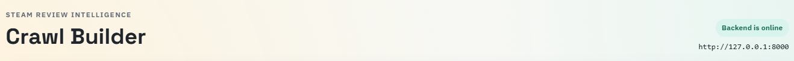

#### 2. Tab Switch (`Crawler` / `Review Explorer`)

- Main navigation between the two primary workflows:
- `Crawler` for building/updating datasets.
- `Review Explorer` for querying and inspecting review matches inside an existing dataset.


#### 3. Layout Control

- Changes how the filter/configuration panels are positioned on the page.
- `Sidebar Filters` is useful for long sessions with many settings.
- `Top Ribbon Filters` is useful on narrower screens or when the result/job panels should stay closer to the top.

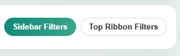

#### 4. Tag Selection

- Central block for choosing Steam tags that define the crawl scope.
- Works in a single Steam-style list where each tag can be:
- included (`+`) to narrow the dataset toward relevant products,
- excluded (`-`) to remove noisy categories from the crawl.
- Includes text search across tags and selected-rule chips for quick editing/removal.
- Shows an approximate match-count hint so the user can estimate a reasonable `Target games to crawl` value before starting.

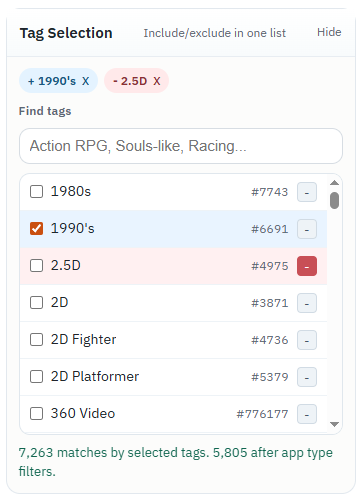

#### 5. App Type Rules

- Filters the crawl by Steam product type (`game`, `demo`, `dlc`, `application`, etc.).
- Uses the same include/exclude interaction model as tag selection, which keeps the UI consistent.
- Useful for building focused datasets (for example: only demos, only games, or games excluding DLC).

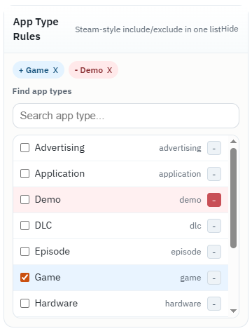

#### 6. Core Crawl Setup

- Main crawl configuration block used in almost every run.
- Defines dataset name, target number of products, review source, and per-product review depth.
- Includes Steam request page/batch sizing controls that affect crawl speed and request efficiency.
- This block is the minimum required setup to run a small test crawl from the UI.

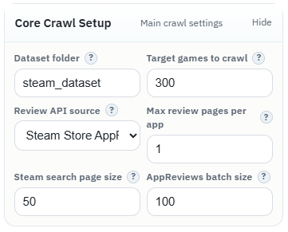

#### 7. Performance + Retry

- Advanced tuning block for performance and reliability.
- Controls worker concurrency, global request rate limit (RPM), HTTP retries, retry backoff, jitter, and timeout values.
- This is the main place to tune the crawler when balancing speed against Steam throttling (`429`) and transient network errors.

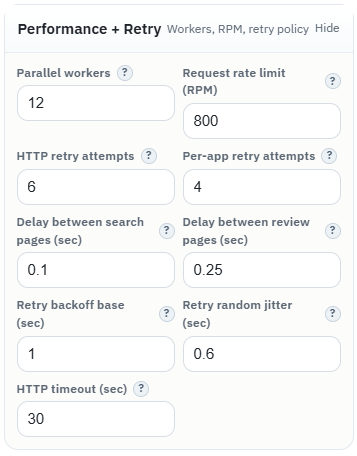

#### 8. Flags

- Boolean switches that change crawler behavior without changing the main numeric settings.
- Includes resume mode, appdetails enrichment storage options (compact/raw), and exclusion of `Coming soon` products.
- These options are important for long-running crawls and dataset quality control.

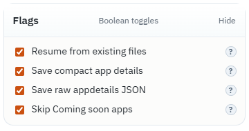

#### 9. Current Job

- Live status panel for the currently selected crawl job.
- Shows job id, state, progress percentage, progress bar, and stage/status text.
- Includes controls for refreshing job state and stopping a running crawl without killing the backend process.

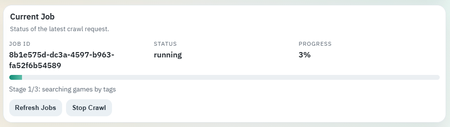

#### 10. Latest Jobs

- Compact queue/history view of recent jobs created through the backend.
- Each row summarizes dataset, selected filters context (tags/app types), and current progress.
- `Watch` lets the user switch the `Current Job` panel to any listed job for monitoring.


### Review Explorer Tab

#### 1. Dataset + Keywords

- Entry point for review analysis in the `Review Explorer` tab.
- Selects which dataset to query and reloads the dataset list/schema when needed.
- Manages include/exclude keyword chips, matching mode (`ANY` / `ALL`), and case-sensitivity behavior.
- Includes result sizing controls such as minimum matched reviews per game and number of games shown per page.

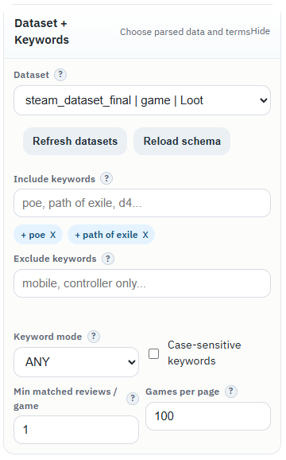

#### 2. Game Filters

- Dynamic filter builder for game-level fields (name, app type, platforms, price, release data, tags, etc.).
- Field list is generated from the actual dataset schema, so filters adapt to the data available in that dataset.
- Supports typed operators for strings, numbers, booleans, arrays, and date-like values.

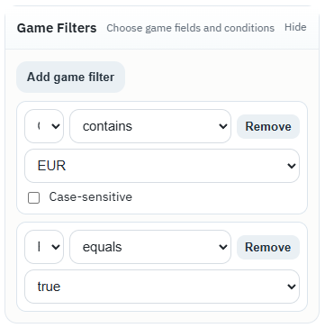

#### 3. Review Filters

- Dynamic filter builder for review-level fields (recommendation, language, playtime, timestamps, etc.).
- Supports numeric-like string fields (for example playtime text converted to numeric behavior) and date/time filtering.
- Lets the user reduce noise before keyword matching by filtering reviews structurally first.

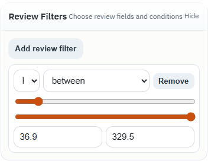

#### 4. Matched Games (Sort Bar + Results List)

- Main result panel after running a review search query.
- Shows query status and summary statistics (scanned games/reviews, filtered counts, total matches).
- Contains sortable controls for ranking the game list by match volume, total reviews, match rate, positive/negative matches, or name.
- Each result row includes a Steam Store link and a clickable game title that loads detailed review matches into `Selected Game`.

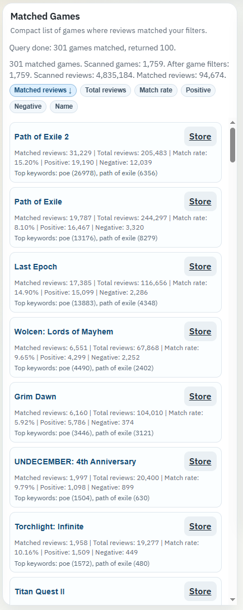

#### 5. Selected Game (Metadata + Matched Reviews)

- Detail panel for the game selected from the `Matched Games` list.
- Shows compact structured metadata (app type, tags, platforms, developers, pricing, release info, etc.) in a dense grid.
- Review list below shows only matched reviews and highlights include-keyword hits directly in review text.
- Includes clickable links (store/review URLs when available) and review metadata such as recommendation state, language, playtime, and date.

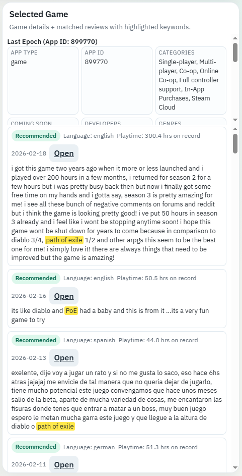

## API Usage (Examples)

### Health

```bash
curl http://127.0.0.1:8000/health
```

### List datasets

```bash
curl http://127.0.0.1:8000/datasets
```

### Start crawl job

```bash
curl -X POST http://127.0.0.1:8000/jobs/crawl \
  -H "Content-Type: application/json" \
  -d '{
    "tags": ["Action RPG", "Loot"],
    "dataset_dir": "arpg_poe_candidates",
    "include_app_types": ["game"],
    "max_games": 300,
    "max_review_pages_per_game": 1,
    "resume": true,
    "enrich_appdetails": true
  }'
```

### Review explorer query

```bash
curl -X POST http://127.0.0.1:8000/datasets/arpg_poe_candidates/explore/query \
  -H "Content-Type: application/json" \
  -d '{
    "include_keywords": ["poe", "path of exile"],
    "keyword_mode": "any",
    "min_matched_reviews": 1,
    "sort_by": "matched_reviews",
    "sort_order": "desc",
    "limit": 20
  }'
```

## Architecture

### Backend (`steam_backend_api.py`)

- FastAPI app
- job manager for crawl/search jobs
- dataset discovery and dataset APIs
- review explorer schema/query endpoints
- appdetails read/refresh endpoints

### UI (`steam_frontend_flask.py` + `static/` + `templates/`)

- Flask server (thin proxy + HTML page)
- browser app for crawler and review exploration

### Crawler Core (`steam_one_time_crawl.py`)

- Steam tag resolution
- Steam search pagination
- app type filtering
- review fetching (`appreviews` or community source)
- retries / throttling / RPM control
- optional appdetails enrichment

## Performance Notes

- Steam can throttle aggressively (`429`) during long runs.
- The crawler includes retry, backoff, jitter and RPM limiting.
- `enrich_appdetails=true` uses a safer runtime RPM cap to reduce throttling.
- Large runs are designed for `resume=true` workflows.

## Review Explorer Schema Behavior

The Review Explorer builds dynamic filters from dataset schema.

For large datasets, schema profiling uses review-row sampling and stores a cache file in the dataset directory to keep UI loading responsive.

This affects schema generation only. Review search queries still scan dataset reviews for actual matching.

## Environment Variables (Optional)

- `STEAM_DATASETS_DIR` - dataset root folder name (default: `datasets`)
- `STEAM_API_BASE_URL` - Flask UI -> backend URL (default: `http://127.0.0.1:8000`)
- `STEAM_UI_HOST` - Flask bind host (default: `127.0.0.1`)
- `STEAM_UI_PORT` - Flask bind port (default: `5050`)
- `STEAM_UI_DEBUG` - Flask debug mode
- `STEAM_UI_TIMEOUT_SECONDS` - Flask proxy timeout to backend

## Roadmap / Future Improvements

- major visual UI/UX redesign and polish (current interface is functional but visually rough)
- optional indexed storage (SQLite/Postgres/FTS) for faster large-dataset queries
- export/import presets for crawler and explorer filter configurations
- richer analytics views (charts, trend summaries, cross-keyword comparisons)
- optional auth/multi-user mode for shared deployments
